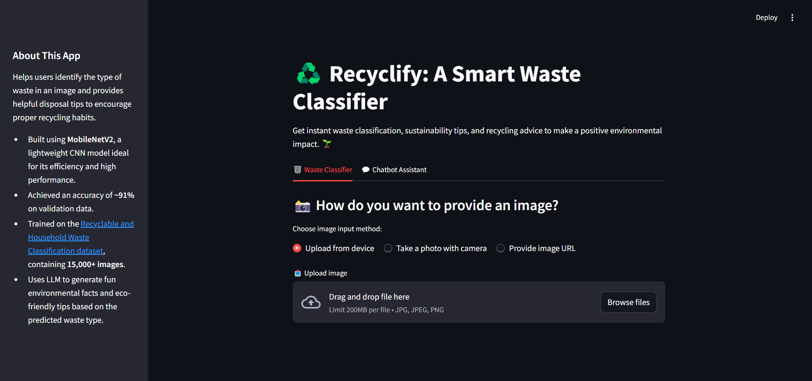
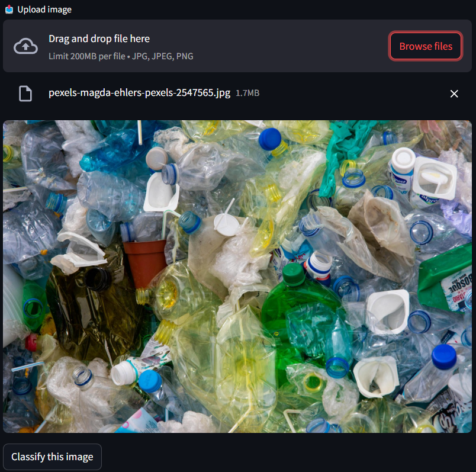
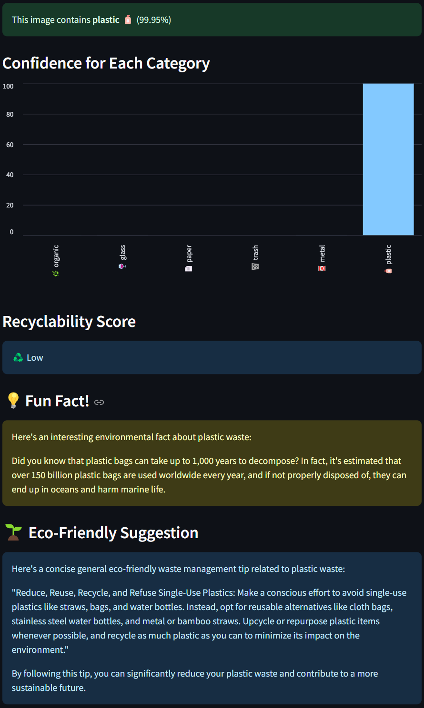
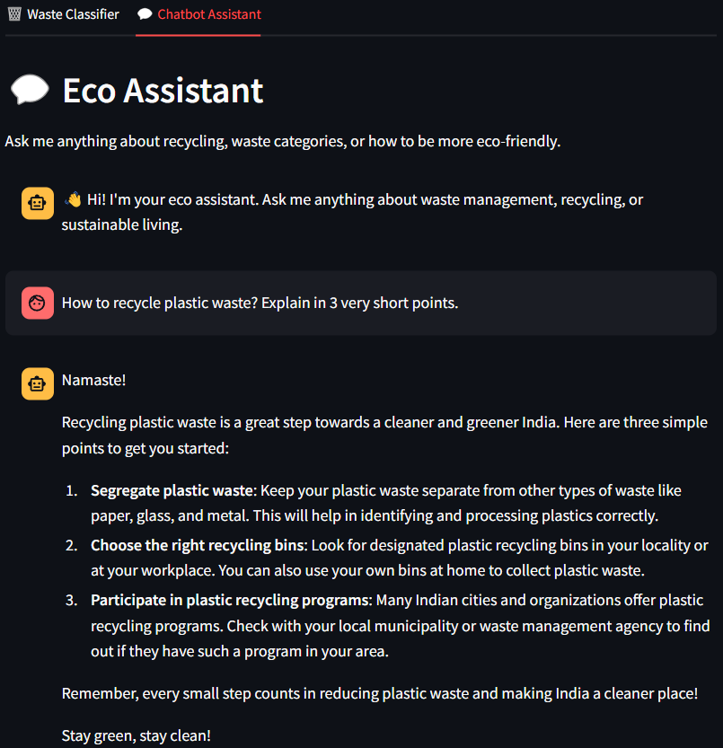

# ♻️ Recyclify: A Smart Waste Classification App

Deep Learning-powered waste classification with real-time Streamlit web app and LLM-based chatbot support.

## 📖 About

This project automates **waste classification** into categories like organic, recyclable, etc., using deep learning (MobileNetV2) and provide a **user-friendly web application** built with Streamlit. It also integrates a **GROQ LLM-based chatbot** for any real-time assistance regarding waste segregation.

## ✨ Features

- 🔥 Train lightweight MobileNetV2 model for classification
- 🖼️ Predict waste type from uploaded or URL-based images
- 🤖 Chatbot integration for real-time waste management queries
- 📈 Visualize training history (accuracy/loss graphs)
- 🗃️ Dataset reorganization utility

## 🛠️ Tech Stack

- **Frontend:** Streamlit
- **Backend:** TensorFlow, Python
- **Model:** MobileNetV2 (Pretrained)
- **LLM:** GROQ (via API)
- **Miscellaneous:** Pillow, Numpy, Requests, Tqdm, Matplotlib

## 🛠️ Setup Instructions

### 1. Clone the Repository

```bash
git clone https://github.com/shubhruia/recyclify.git
cd smart-waste-classification
```

### 2. Create a Virtual Environment

```bash
python -m venv venv
source venv/bin/activate  # On Windows: venv\Scripts\activate
```

### 3. Install Requirements

```bash
pip install -r requirements.txt
```

### 4. Add `.env` File

Create a `.env` file in the root directory and add your GROQ API Key:

```bash
GROQ_API_KEY=your_groq_api_key_here
```

### 5. Train the Model (Optional)

If you wish to train your own model:

- Run `train_model.ipynb` notebook.
- Save the trained model as `waste_model.h5` in the root directory.

### 6. Run the Streamlit App

```bash
streamlit run app.py
```

## 🚀 How to Use

1. Upload an image or provide an image URL.
2. The model will predict the waste category.
3. Chat with the integrated LLM for advice or doubts.
4. View training graphs and model performance.

## 🎥 Demo

[](https://youtu.be/vUDj-ckzLRU)

## 🖼️ Screenshots

### Home Page


### Image Upload Section


### Prediction Result


### Chatbot Interaction


## 🤝 Contributing

Contributions are welcome!  
If you find a bug or want a feature, feel free to open an issue or a pull request.

1. Fork the repository.
2. Create your feature branch (`git checkout -b feature/feature-name`).
3. Commit your changes (`git commit -m 'Add some feature'`).
4. Push to the branch (`git push origin feature/feature-name`).
5. Open a Pull Request.

## 📜 License

Distributed under the **MIT License**.  
See [LICENSE](LICENSE) for more information.

## 📬 Contact

- **Shubh Ruia:** [LinkedIn](https://www.linkedin.com/in/shubh-ruia/)
- **Project Link:** [GitHub](https://github.com/shubhruia/recyclify)
